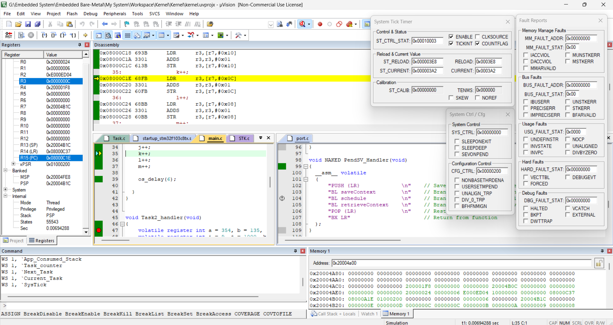

# RTOS Kernel

A portable Real-Time Operating System (RTOS) kernel designed for flexibility and compatibility across various hardware platforms. This kernel provides essential task management functions, including task creation, scheduling, context switching, and more.

## Features

- Task management with create, suspend, resume, and delete operations
- Round-robin scheduling algorithm
- Support for task states: running, ready, blocked, suspended, and deleted
- Configurable stack sizes and priorities
- Portable across different hardware platforms and toolchains
- Example port for STM32F10x using ARM Cortex-M3 and GCC

## Directory Structure

```plaintext
project-root/
├── Inc/
│   ├── LIB/
│   │   ├── std_types.h        // Standard types definitions
│   │   ├── common_macros.h    // Common macros
│   ├── kernel/
│   │   ├── Task.h             // Task management functions and types
│   │   ├── kernel_cfg.h       // Kernel configuration
│   │   ├── kernel_interface.h // Kernel APIs
│   │   ├── port/
│   │   │   ├── port.h         // Port-specific common definitions
│   │   │   └── STK/           // STK-specific port implementation
│   │   │       └── ...        // STK port-specific files
└── Src/
    ├── kernel/
    │   ├── Task.c             // Task management implementation
    │   ├── kernel.c           // Kernel main implementation
    │   ├── kernel_port/
    │   │   ├── STK/           // STK-specific implementation
    │   │   └── port.c         // Port-specific source file
    │   └── ...                // Other source files
```

## Getting Started

### Prerequisites

- ARM Cortex-M3 development board (e.g., STM32F10x)
- GCC toolchain for ARM Cortex-M
- Keil uVision or any other compatible simulator/debugger

### Building the Kernel

1. Clone the repository:
    ```sh
    git clone https://github.com/your-username/portable-rtos-kernel.git
    cd portable-rtos-kernel
    ```

2. Configure the kernel in `Inc/kernel/kernel_cfg.h` according to your requirements.

3. Build the project using your preferred toolchain.

### Running and Debugging

1. Flash the compiled binary to your ARM Cortex-M3 development board.
2. Use Keil uVision (or any compatible debugger) to debug the kernel.

### Example Screenshot

A screenshot of the kernel running in the Keil simulator:



## API Documentation

### Task Management

- **Create Task**
  ```c
  OS_TaskError_t OS_createTask(Task_Handler_t* task_handler, const osFunc_t task_func, const char* name, const uint32 priority, const uint32 stackSize);
  ```

- **Delay Task**
  ```c
  void os_delay(uint32 ticks);
  ```

- **Suspend Task**
  ```c
  void os_suspendTask(Task_Handler_t taskhandler);
  ```

- **Resume Task**
  ```c
  void os_resumeTask(Task_Handler_t taskhandler);
  ```

- **Delete Task**
  ```c
  void os_deleteTask(Task_Handler_t taskhandler);
  ```

## Configuration

Edit the `kernel_cfg.h` file to configure the kernel parameters such as the scheduling algorithm, system tick duration, maximum number of tasks, stack sizes, and more.

```c
#define SCHEDULE_ALGORITHM          ROUND_ROBIN
#define CPU_INPUT_CLOCK             8000000
#define SYSTEM_TICK                 1
#define MAX_TASKS                   10
#define SCHEDULE_STACK_SIZE         1024
#define DEFAULT_TASK_STACK_SIZE     1024
#define APP_STACK_SIZE              16384
#define TASK_NAME_LEN               12
#define SYSTEM_FAULTS               ENABLED
#define SCHEDULE_STACK_START        SRAM_END
```

## Contributing

Contributions are welcome! Please fork the repository and submit a pull request.

